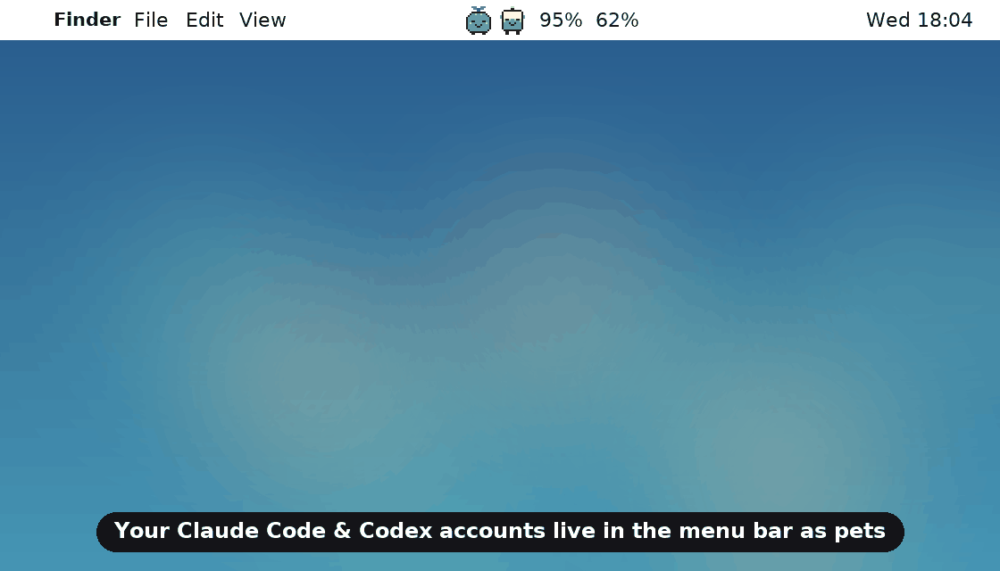
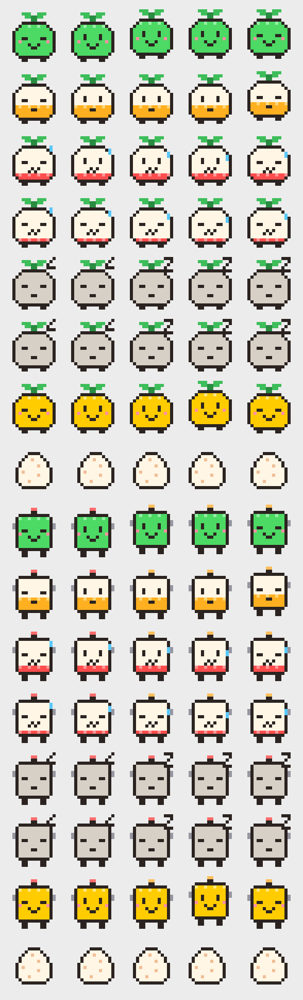

# aipets 🐣

**Your Claude Code and Codex accounts as tamagotchi pets in the macOS menu bar.**
Each pet's life is the quota left on that account. Feed it, switch it, and never
hit a limit by surprise again.



- 🐾 **One pet per account.** Claude Code accounts are *Mochi* (a sprout), Codex accounts are *Bit* (a robot).
  The body fills with "life" = what's left of the tightest limit (5-hour or weekly).
- 📊 **Real numbers, every account at once**, not just the active one: 5h / weekly / per-model limits,
  reset countdowns, pace ("runs out in ~40m, before the reset"), saved limit resets.
- 😴 **Moods that mean something.** Thriving → hungry (sweating) → asleep until the limit resets.
  An egg while it's still checking, a "?" when a login needs refreshing.
- 🔔 **Alerts** at 20% left, when a limit runs out, and when it's back.
- 🔀 **One-click switching** between accounts (via [aisw](https://github.com/burakdede/aisw)), with VS Code restarted
  so its Claude Code and Codex panels pick up the new login. A ✨ hint suggests the account with the most life.
- ➕ **Add and remove accounts** from the menu: sign in with the browser or paste an API key.

## Moods



| Life left | Mood | What the pet does |
|---|---|---|
| 60%+ | 😊 Thriving | bounces, blushes, green |
| 30–59% | 🙂 Doing fine | calm, amber |
| 10–29% | 😰 Hungry | sweat drop, red |
| under 10% | 🥵 Exhausted | half-closed eyes |
| limit hit | 😴 Asleep | floating Z until the reset |
| login expired | 💤 Snoozing | "?" — open Claude Code / Codex once to wake it |
| no data yet | 🥚 Egg | wobbles while the first check runs |
| API key | 🪙 Well fed | gold, pay-as-you-go |

## Requirements

- macOS with [SwiftBar](https://swiftbar.app) (`brew install --cask swiftbar`)
- [aisw](https://github.com/burakdede/aisw) with your Claude Code / Codex accounts saved as profiles
- Python 3.7+ (the one that ships with macOS's command line tools is fine — no packages needed)

## Install

```bash
git clone https://github.com/Kakoedlinnoeslovo/aipets.git && cd aipets

# the widget
mkdir -p ~/SwiftBar && cp aipets.py ~/SwiftBar/ && chmod +x ~/SwiftBar/aipets.py

# the switcher it uses (also handy on its own)
mkdir -p ~/.local/bin && cp aiswitch ~/.local/bin/ && chmod +x ~/.local/bin/aiswitch

# point SwiftBar at the folder and start it
defaults write com.ameba.SwiftBar PluginDirectory "$HOME/SwiftBar"
open -a SwiftBar
```

On the first check macOS may ask whether `security` can read *Claude Code-credentials…* from your
Keychain — that's aipets reading your saved Claude login to ask for its quota. Choose **Always Allow**.

## Using it

- **Hover an account** for its bars, reset times, pace and notes. Hold **⌥** for exact reset times.
- **Switch to …** makes it the active account and restarts VS Code with it.
- **＋ Add a … account** asks for sign-in method and a name, then opens Terminal for the login.
  API keys are typed there, never into the widget.
- **Remove this account…** deletes the saved login from this Mac (aisw keeps a backup). Not allowed for the active account.
- **Animation** can be turned off if you prefer still pets.

`aiswitch` also works from the terminal:

```bash
aiswitch              # numbered menu of your accounts
aiswitch codex work   # switch directly
aiswitch --list       # show what's active
aiswitch --reopen     # restart VS Code with the current accounts
```

> **Why VS Code needs a restart:** aisw keeps each account in its own folder and points the tools at it with
> `CLAUDE_CONFIG_DIR` / `CODEX_HOME`. VS Code only reads those when it starts, so aipets relaunches it with the
> right values. Windows connected over SSH keep the server's own login.

## How it works

The menu is drawn from a local cache, so it's instant. The same script runs in the background to refresh
the numbers:

| | Where the numbers come from | How often |
|---|---|---|
| Claude Code | the usage endpoint Claude Code's own `/usage` screen calls (`api.anthropic.com/api/oauth/usage`) | every 10 min (active) / 20 min |
| Codex | the usage endpoint Codex polls (`chatgpt.com/backend-api/wham/usage`), then `codex app-server`'s documented `account/rateLimits/read`, then the last session log | every 3 min (active) / 10 min |

**Read-only by design.** aipets never refreshes or rewrites a login (refresh tokens are single-use, so doing that
would log Claude Code or Codex out), never sends prompts with your subscription, and never writes tokens to disk,
logs or command lines. If a service says "slow down", it backs off and keeps showing the last numbers with their age.

These usage endpoints are unofficial and change from time to time; aipets parses them defensively, but a service
update can break a row. Please open an issue with the "Updated …" line if that happens.

## Troubleshooting

- **A Claude account shows "no login saved".** Check that its Keychain item exists:
  ```bash
  for d in ~/.aisw/profiles/claude/*; do h=$(printf '%s' "$d" | shasum -a 256 | cut -c1-8); security find-generic-password -s "Claude Code-credentials-$h" >/dev/null 2>&1 && echo "$d: found" || echo "$d: missing"; done
  ```
- **"Login needs a refresh".** Open Claude Code or Codex once on that account; it refreshes its own login.
- **The menu flickers while open.** Turn **Animation** off at the bottom of the menu.
- **Nothing happens on click.** Make sure `aiswitch` is in `~/.local/bin` and executable.

## Development

```bash
python3 docs/make_demo.py      # re-render docs/demo.gif and docs/demo.mp4 from the real sprites (needs Pillow)
./aipets.py once               # print the menu once, without SwiftBar
./aipets.py fetch all          # refresh every account now
```

The pets are original pixel art defined as text in `aipets.py` (`SPRITES`), rendered to PNG with a tiny
built-in encoder — no image libraries needed at runtime.

## Credits

Built on [aisw](https://github.com/burakdede/aisw) for account storage and switching, and
[SwiftBar](https://github.com/swiftbar/SwiftBar) for the menu bar. Usage-endpoint details were cross-checked
against [CodexBar](https://github.com/steipete/CodexBar) and [claude-swap](https://github.com/realiti4/claude-swap).

Not affiliated with Anthropic or OpenAI.

## License

MIT
